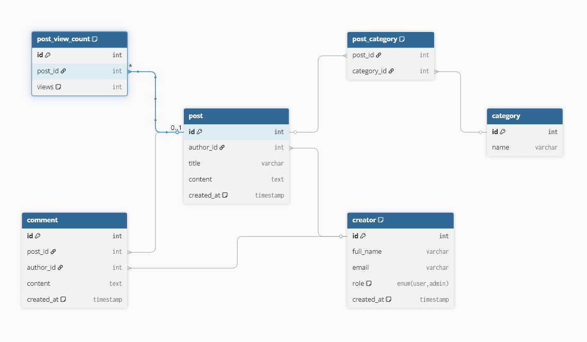

Blog API
Проект блога на Django с REST API, WebSocket-уведомлениями и документацией Swagger. В нем можно управлять постами,
комментариями, категориями и создателями, а также отслеживать просмотры постов.

## 1. Настройка
Склонируйте репозиторий:
git clone https://github.com/Bakachuba/blog_django
cd blog_django

## 2. Создайте файл .env в корне проекта:
DEBUG=True
SECRET_KEY=secretkey
REDIS_URL=redis://redis:6379/0

## 3. Соберите и запустите контейнеры:

docker-compose up --build

## 4. Примените миграции и создайте суперпользователя:

docker-compose exec web python manage.py makemigrations
docker-compose exec web python manage.py migrate
docker-compose exec web python manage.py createsuperuser

## Доступ

API: http://localhost:8000/api/
Swagger: http://localhost:8000/swagger/
Админ-панель: http://localhost:8000/admin/ (войдите с суперпользователем)
WebSocket: ws://localhost:8000/ws/notifications/

## API
GET /api/creators/: Получить список создателей (юзеры).
POST /api/creators/: Создать нового создателя.

PUT /api/creators/: Обновить создателя.

PATCH /api/creators/: Частично обновить создателя.

DELETE /api/creators/: Удалить создателя.

GET /api/posts/: Получить список постов.

POST /api/posts/: Создать новый пост.

PUT /api/posts/: Обновить пост.

PATCH /api/posts/: Частично обновить пост.

DELETE /api/posts/: Удалить пост.

GET

/api/comments/: Список комментариев.

POST

/api/comments/: Создать новый комментарий.

PUT

/api/comments/: Обновить комментарий.

PATCH

/api/comments/: Обновить часть комментария.

DELETE

/api/comments/: Удалить комментарий.

GET

/api/categories/: Список категорий.

POST

/api/categories/: Создать новую категорию.

PUT

/api/categories/: Полностью обновить категорию.

PATCH

/api/categories/: Обновить часть категории.

DELETE

/api/categories/: Удалить категорию.

POST

/api/post-view-counts/: Просмотр поста.

WebSocket

ws://:8000/ws/notifications/: Получать уведомления о создателях.

## Models

● Один к одному (OneToOne)
Post <-> PostViewCount

● Один ко многим (ForeignKey)
Comment -> Post

● Многие ко многим (ManyToMany)
Post <-> Category

● Многие к одному (обратная связь)
User <- Post, Comment

## Models Visualisation Scheme

